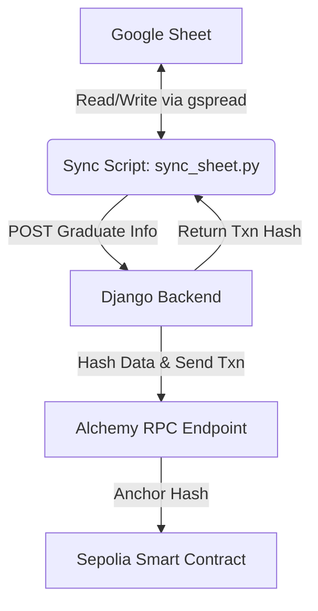

# Web3 Credential Minting & Google Sheets Synchronizer

This project is a decentralized application (dApp) backend built with Django REST Framework and Web3.py. It automates the process of verifying and anchoring academic credentials (e.g., student graduation records) onto the **Ethereum Sepolia Testnet** and synchronizes status updates back to a **Google Sheet**.

---

## System Architecture



1. **Google Sheets**: Serves as the database of graduates. The synchronizer script reads new entries and writes back transaction hashes once they are successfully anchored on-chain.
2. **Django Backend**: Generates a SHA-256 hash of the graduate's information, formats it for Solidity (`bytes32`), and signs/sends a transaction to anchor it.
3. **Sepolia Smart Contract**: Store valid hashes immutably on the Ethereum blockchain for decentralized verification.

---

## Features

- **Google Sheets Integration**: Automatically processes rows that do not have a `Transaction Hash` and writes the hash back to the sheet once confirmed.
- **On-Chain Anchoring**: Hashes the student's unique details (`Name-Course-Graduation Date`) and stores them using a smart contract on Ethereum Sepolia.
- **Decentralized Verification**: Instant check against the smart contract state via a public API endpoint.

---

## Setup & Installation

### 1. Prerequisites
- Python 3.10+
- A Google Cloud Platform (GCP) project with the **Google Sheets** and **Google Drive** APIs enabled.
- An Alchemy (or other provider) API Key for Ethereum Sepolia.
- A Sepolia wallet with a small amount of test ETH.

### 2. Install Dependencies
Clone the repository and set up a virtual environment:
```bash
python -m venv venv
venv\Scripts\activate
pip install -r requirements.txt
```
*(Make sure `web3`, `gspread`, `django`, `djangorestframework`, and `requests` are installed).*

### 3. Environment Configuration (`.env`)
Create a `.env` file in the root directory:
```env
# Web3 Configuration
ALCHEMY_RPC_URL="https://eth-sepolia.g.alchemy.com/v2/YOUR_API_KEY"
WALLET_PRIVATE_KEY="YOUR_WALLET_PRIVATE_KEY"
CONTRACT_ADDRESS="YOUR_SMART_CONTRACT_ADDRESS"

# Django Configuration
DJANGO_SECRET_KEY="your-secret-key"
DEBUG=True
```

### 4. Google Credentials
Place your Google Service Account credential JSON file in the root directory and name it `google_credentials.json`. 

Ensure that:
1. The **Google Sheets API** is enabled in the Google Developer Console.
2. The target Google Sheet is shared with the `client_email` specified in your `google_credentials.json` (grant **Editor** permissions).

---

## API Endpoints

### 1. Issue & Anchor Credential
Hashes the credential data and anchors it on the blockchain.

* **URL**: `/api/v1/issue/`
* **Method**: `POST`
* **Payload**:
  ```json
  {
    "name": "Azizi",
    "course": "Blockchain Engineering",
    "graduation_date": "2026-06-18"
  }
  ```
* **Success Response (201 Created)**:
  ```json
  {
    "status": "success",
    "message": "Credential successfully anchored to blockchain.",
    "student": "Azizi",
    "document_hash": "9b8a333b8fd3f6e34ecca01aeaa974ea03888d3a826bcae968429a3af9fdadd3",
    "transaction_hash": "0x...",
    "explorer_url": "https://sepolia.etherscan.io/tx/0x..."
  }
  ```

### 2. Verify Credential
Queries the smart contract directly to verify if the given SHA-256 hash was officially issued.

* **URL**: `/api/v1/verify/<document_hash>/`
* **Method**: `GET`
* **Success Response (200 OK)**:
  ```json
  {
    "status": "success",
    "message": "Credential is valid.",
    "document_hash": "9b8a333b8fd3f6e34ecca01aeaa974ea03888d3a826bcae968429a3af9fdadd3",
    "anchored_timestamp": 1718719875
  }
  ```

---

## Usage

### Step 1: Start the Django Backend Server
```bash
python manage.py runserver
```

### Step 2: Run the Google Sheets Sync Script
To scan the spreadsheet for new graduates, anchor them, and save the transaction hashes back to Google Sheets, run:
```bash
python sync_sheet.py
```
